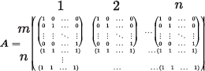

# Functional Optimal Transport

Here we propose to use optimal transport, a traditional mathematical technique, to find optimum transportation policies between connectomes in different resolutions. A policy then is used to transport time series between parcellations given the geometry of brain atlases.
We evaluate the proposed method by measuring the similarity between connectomes obtained by optimal transports and analogous connectomes in training.


# Monge Problem
Lets define some locations $x_1,..,x_n$ in $\alpha$ and some locations $y_1,..,y_m$ in $\beta$. Then we specify weight vector $a$ and $b$ over these locations and define matrix $C$ as a measure of pairwise distances between points $x_i \in \alpha$ and comparable points $\pazocal T (x_i)$;
Monge problem aims to solve the following optimizatin problem:


CAROT uses optimal transport theory, or the mathematics of converting a probability distribution from one set to another, to find an optimal mapping
between two atlases that allows data processed from one atlas to be directly transformed into a connectome based on an
unavailable atlas without needing raw data. CAROT is designed for functional connectomes based on functional magnetic
imaging (fMRI) data. First, in a training sample with fMRI timeseries data from two different atlases, we find this mapping by
solving the Monge–Kantorovich transportation problem7. 

# Kantorvic Relaxation

Kantorvich rather solves the mass transportation problem using a probabilistic approach in which the amount of mass located at  potentially dispatches to several points in target.  
Admissible solution for Kantorvich relaxation is defined by a coupling matrix  indicating the amount of mass being transferred from location  to  by :


# Entropy Regularization and Functional Optimal Transport

For paired time-series data from the same individual but from two different atlases according to the formulation in the paper:


where:



The mapping ${T}$ represents the optimal way of transforming the brain activity data from $n$ regions into $m$ regions.

 Yet, solving a large linear program is computationally hard \cite{Dantzig:83}.
Thus, we use the  entropy regularization, which gives an approximation solution with complexity of   for , and instead solve the following:


 Specifically, we use the Sinkhorn algorithm---an iterative solution \cite{Altschuler:2017}---to find the optimum mapping ${T}$ as implemented in the Python Optimal Transport (POT) toolbox \cite{flamary2017pot}.

## Cost Matrix
Here we define a fixed cost matrix between regions of source and target parcellation. This matrix will be used by Sinkhorn algorithm to find the optimum mapping between time series. 

```python

def corr2_coeff(A, B):
    # Rowwise mean of input arrays & subtract from input arrays themeselves
    A_mA = A - A.mean(1)[:, None]
    B_mB = B - B.mean(1)[:, None]    # Sum of squares across rows
    ssA = (A_mA**2).sum(1)
    ssB = (B_mB**2).sum(1)
    # Finally get corr coeff
    return np.dot(A_mA, B_mB.T) / np.sqrt(np.dot(ssA[:, None],ssB[None]))


all_268_mat = sio.loadmat('data/REST1/all_268.mat')
all_368_mat = sio.loadmat('data/REST1/all_368.mat')
all_268 = all_268_mat['data']
all_368 = all_368_mat['data']
all_behav = genfromtxt('data/REST1/IQ.txt', delimiter=',')
all_sex = genfromtxt('data/REST1/gender.txt', delimiter=',')

test_size = 200
train_size = all_268.shape[0]-test_size
random_samples = random.sample(range(0, all_268.shape[0]), all_268.shape[0])
train_index = random_samples[0:train_size]
test_index = random_samples[train_size:]

coord_268 =pd.read_csv('data/REST1/shen_268_matrix.csv', sep=',',header=None)
coord_368 = pd.read_csv('data/REST1/shen_367_matrix.csv', sep=',',header=None)
M = ot.dist(coord_268, coord_368,metric='cityblock')
M /= M.max()
```

## Learning Mapping
Once we specified the cost matrix and created distributions mu and nu for a fixed time point, then we learn the optimal mapping between these. An optimal mapping is actually transport the source time series to the target one. But, before doing that all at once, we apply mappings on each time frame separately and then stack the final transportations on top of each other to create the target time series. 

```python

def normalize(x):
    return (x-min(x))/(max(x)-min(x))
    
num_subj, num_time_points = all_268.shape[:2]
frame_size = 1200
num_frames = num_time_points/frame_size

G = np.zeros((num_time_points,268,367))

for i in tqdm(range(0,num_time_points,frame_size),"Optimal Transport", ncols = 80, position = 0):#range(num_time_points):
    for j in range(train_size):#(train_size):
        lambd = 1e-3
        a2 = all_268[train_index[j],i,:]
        b2 = all_368[train_index[j],i,:]
        a2 = normalize(a2)+1e-5
        b2 = normalize(b2)+1e-5

        a2= a2/a2.sum(axis=0,keepdims=1)
        b2= b2/b2.sum(axis=0,keepdims=1)
        m = ot.sinkhorn(a2, b2, M, lambd, verbose=False)
        m = m/m.sum(axis=0,keepdims=1)
        G[i:i+frame_size] = G[i:i+frame_size]+ m
    G[i:i+frame_size] = G[i:i+frame_size]/train_size
```

## Reconstructing Connectmes
At the end, all the transported distibutions will be stacked on top of each other to create time series data that we can correlate them to get a matrix of m by m connectome. We use Pearson correlation to create the matrices.

```python
all_behav_test = all_behav[test_index,]
num_subj, num_time_points = all_268.shape[:2]

test_time_series = np.zeros((test_size,num_time_points,367))
for i in tqdm(range(num_time_points),"Timeseries", ncols = 80, position = 0):
    for j in range(test_size):
        a = all_268[test_index[j],i,:]
        b= np.transpose(G[i]).dot(a)
        test_time_series[j,i] = b

all_368_new= np.zeros((test_size,367,367))

for j in tqdm(range(test_size),"Correlation",ncols=80,position=0):
    all_368_new[j] = corr2_coeff(test_time_series[j].T,test_time_series[j].T)
    
results = np.zeros((test_size,2))
for j in  tqdm(range(test_size),"Evaluation",ncols=80,position=0):
    a= all_368_mats[test_index][j]#corr2_coeff(all_368[train_size+j].T,all_368[train_size+j].T)
    b= all_368_new[j]
    results[j][0] = ((a - b)**2).mean()
    results[j][1] = pearsonr(a.flatten(),b.flatten())[0]
```

# Parameter Tuning
As a control we run a couple of other experiments to verify usefulness of the new connectomes in brain-behavior association and individual classification.
To this aim we partition our data into three folds  and  with respective ratio of \{0.25,0.5,0.25\}. 
We first train optimal transport mapping  T using all pairs of  and  in . 
Then we apply T on all  in  to get high resolution  (i.e., here from ).
At the same time, we train a predictive model on all functional connectomes  (i.e., ). 
At the end, we run the model on all functional connectomes obtained from optimal transport named  (i.e., test).
Our baseline is to test the same model on actual functional connectomes .
We used fluid intelligence to study brain-behavior association and sex to classify participants based on.
We also tested significance of the results using re-sampled ttest. 

# Extrinsic Evaluation

In addition to validating our approach, we demonstrated that the transformed connectomes can be used to elucidate brain-behavior associations. 
To this aim, 

1. We partitioned our data into three folds $g_1$, $g_2$, and $g_3$ with a respective ratio of $\{0.25,0.5,0.25\}$. 
2.  Using only participants in $g_1$, we estimated the optimal mapping $\pazocal T$ for both cost matrices. 
3. We applied $\pazocal T$ to the participants in $g_3$ to produce the transformed connectomes ($268 \rightarrow 368$ and $368 \rightarrow 268$).
4. We predicted IQ using ridge regression \cite{Gao:2019} and classified sex using support vector machine (SVM) with a linear kernel \cite{Cortes:1995} using the connectomes in $g_2$ for both the $268 \time 268$ and $368 \time 368$, independently. All models were trained with $10$-fold cross-validation.
5. We used the predictive models from Step \textbf{4)} to
predict phenotypic information using the transformed matrices from Step \textbf{3)} (\textit{e.g.}, using the $268 \rightarrow 368$ connectomes as inputs to the models trained with the $368 \time 368$ connectomes).

